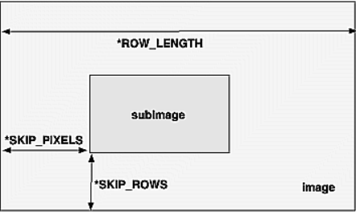

Pixel Packing and Unpacking
    Packing：将pixel数据写入cpu 内存
    Unpacking：从cpu 内存读取pixel数据

    image数据在内存中存储为1~4个elements,每个element表示一个luminance或RGBA某个component。image的格式决定了每个pixel存储的element数量和顺序。
    Elements can be stored in memory as various data types, ranging from 8-bit bytes to 32-bit integers or floating-point numbers.

Controlling Pixel-Storage Modes
    Image data is typically stored in processor memory in rectangular two- or three-dimensional arrays. Often, you want to display or store a subimage that corresponds to a subrectangle of the array. In addition, you might need to take into account that different machines have different byte-ordering conventions. Finally, some machines have hardware that is far more efficient at moving data to and from the framebuffer if the data is aligned on 2-byte, 4-byte, or 8-byte boundaries in processor memory. For such machines, you probably want to control the byte alignment.

    If the *SWAP_BYTES parameter is FALSE (the default), the ordering of the bytes in memory is whatever is native for the OpenGL client; otherwise, the bytes are reversed. The byte reversal applies to any size element, but really only has a meaningful effect for multibyte elements.

    Note: As long as your OpenGL application doesn't share images with other machines, you can ignore the issue of byte ordering. If your application must render an OpenGL image that was created on a different machine and the "endianness" of the two machines differs, byte ordering can be swapped using *SWAP_BYTES. However, *SWAP_BYTES does not allow you to reorder elements (for example, to swap red and green).

    The *LSB_FIRST parameter applies when drawing or reading 1-bit images or bitmaps, for which a single bit of data is saved or restored for each pixel. If *LSB_FIRST is FALSE (the default), the bits are taken from the bytes starting with the most significant bit; otherwise, they're taken in the opposite order. For example, if *LSB_FIRST is FALSE, and the byte in question is 0x31, the bits, in order, are {0, 0, 1, 1, 0, 0, 0, 1}. If *LSB_FIRST is TRUE, the order is {1, 0, 0, 0, 1, 1, 0, 0}.

    Sometimes you want to draw or read only a subrectangle of the entire rectangle of image data stored in memory. If the rectangle in memory is larger than the subrectangle that's being drawn or read, you need to specify the actual length (measured in pixels) of the larger rectangle with *ROW_LENGTH. If *ROW_LENGTH is zero (which it is by default), the row length is understood to be the same as the width that's specified with glReadPixels(), glDrawPixels(), or glCopyPixels(). You also need to specify the number of rows and pixels to skip before starting to copy the data for the subrectangle. These numbers are set using the parameters *SKIP_ROWS and *SKIP_PIXELS, as shown in Figure 8-9. By default, both parameters are 0, so you start at the lower-left corner.

    

    Often a particular machine's hardware is optimized for moving pixel data to and from memory, if the data is saved in memory with a particular byte alignment. For example, in a machine with 32-bit words, hardware can often retrieve data much faster if it's initially aligned on a 32-bit boundary, which typically has an address that is a multiple of 4. Likewise, 64-bit architectures might work better when the data is aligned to 8-byte boundaries. On some machines, however, byte alignment makes no difference.

    As an example, suppose your machine works better with pixel data aligned to a 4-byte boundary. Images are most efficiently saved by forcing the data for each row of the image to begin on a 4-byte boundary. If the image is 5 pixels wide and each pixel consists of 1 byte each of red, green, and blue information, a row requires 5 ´ 3 = 15 bytes of data. Maximum display efficiency can be achieved if the first row, and each successive row, begins on a 4-byte boundary, so there is 1 byte of waste in the memory storage for each row. If your data is stored like this, set the *ALIGNMENT parameter appropriately (to 4, in this case).

    If *ALIGNMENT is set to 1, the next available byte is used. If it's 2, a byte is skipped if necessary at the end of each row so that the first byte of the next row has an address that's a multiple of 2. In the case of bitmaps (or 1-bit images) where a single bit is saved for each pixel, the same byte alignment works, although you have to count individual bits. For example, if you're saving a single bit per pixel, the row length is 75, and the alignment is 4, then each row requires 75/8, or 9 3/8 bytes. Since 12 is the smallest multiple of 4 that is bigger than 9 3/8, 12 bytes of memory are used for each row. If the alignment is 1, then 10 bytes are used for each row, as 9 3/8 is rounded up to the next byte. (There is a simple use of glPixelStorei() in Example 8-4.)
    